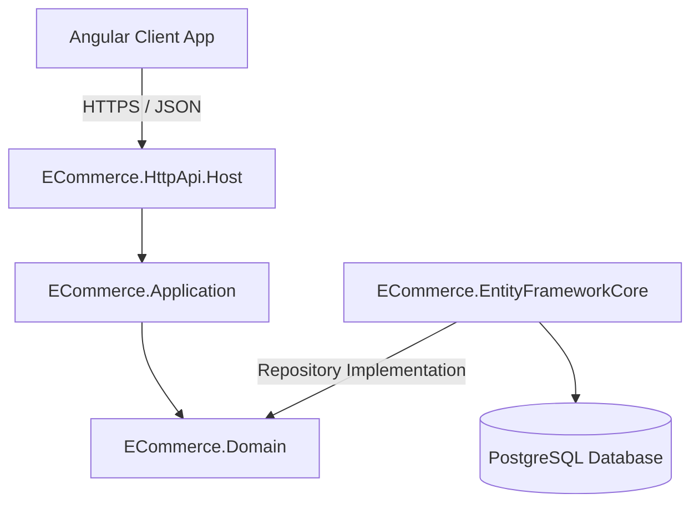

# 🛒 Advanced Multi-Tenant E-Commerce Platform

[](https://abp.io/)
[](https://dotnet.microsoft.com/)
[](https://www.postgresql.org/)
[](https://angular.io/)
[](#architecture-overview)

A complete, production-grade, multi-tenant e-commerce startup solution built on the **ABP Framework** using **Domain-Driven Design (DDD)** practices. This system includes an advanced ASP.NET Core (.NET 10) backend, a responsive Angular frontend, and PostgreSQL database integration. It is specifically designed to provide a rich set of modern marketing, catalog, checkout, and loyalty features.

---

## 📌 Table of Contents

- [🚀 Architecture Overview](#-architecture-overview)
- [✨ Key Features](#-key-features)
  - [1. Catalog & Product Management](#1-catalog--product-management)
  - [2. Shopping Cart & Checkout](#2-shopping-cart--checkout)
  - [3. Orders & Shipment Management](#3-orders--shipment-management)
  - [4. Marketing, Engagement & Loyalty](#4-marketing-engagement--loyalty)
  - [5. Customers & Address Management](#5-customers--address-management)
  - [6. Multi-Tenancy & Platform Security](#6-multi-tenancy--platform-security)
- [🛠️ Tech Stack](#️-tech-stack)
- [💻 Getting Started](#-getting-started)
  - [Prerequisites](#prerequisites)
  - [1. Database Configuration](#1-database-configuration)
  - [2. Running Migrations](#2-running-migrations)
  - [3. Starting the Backend API](#3-starting-the-backend-api)
  - [4. Starting the Angular Frontend](#4-starting-the-angular-frontend)
- [🛡️ Security & Signing Certificates](#️-security--signing-certificates)
- [📁 Project Structure](#-project-structure)
- [📄 Documentation](#-documentation)

---

## 🚀 Architecture Overview

This solution follows a clean **Domain-Driven Design (DDD)** structure to ensure clean boundaries, separation of concerns, and maintainability:



- **Domain Layer (`ECommerce.Domain`)**: Contains the core business entities, aggregate roots, domain services, value objects, and repository interfaces.
- **Application Layer (`ECommerce.Application`)**: Coordinates the workflow of the application and exposes Data Transfer Objects (DTOs) via application services.
- **Infrastructure Layer (`ECommerce.EntityFrameworkCore`)**: Implements data access using EF Core against PostgreSQL, managing migrations and database mapping.
- **API Host (`ECommerce.HttpApi.Host`)**: Provides REST endpoints, configures OpenIddict for OAuth2/OIDC token generation, and boots the backend services.

---

## ✨ Key Features

### 1. Catalog & Product Management
Provides full control over your digital storefront, supporting flexible product definitions, attributes, and reviews.
*   **Hierarchical Categories:** Tree-structured navigation mapping using `Category` with custom display ordering and URL slugs.
*   **Brands & Models:** Organize products under a strict hierarchy using `Brand` and parent-linked `BrandModel`.
*   **Rich Product Meta:** `Product` aggregate root supporting variants (`ProductVariant`), attributes (`ProductAttribute`), and media types (`ProductMedia`) for high-res images and videos.
*   **Customer Reviews:** Fully moderated review system through `ProductReview` and `ProductReviewStatus`.
*   **Inventory Control:** Track stock levels using `Inventory` entities.

### 2. Shopping Cart & Checkout
A seamless customer purchase workflow optimized for high conversion rates.
*   **Persistent Carts:** Tracks user selections using `Cart` and `CartItem` models.
*   **Simplified Checkout:** Guest and authenticated user flows with automatic shipping and tax calculation integrations.

### 3. Orders & Shipment Management
End-to-end transaction fulfillment and historical logging.
*   **Order Fulfillment:** Structured sales tracking with `Order` and `OrderLine` items.
*   **State History:** Tracks order lifecycle transitions through `OrderStatus` and `OrderStatusHistory`.
*   **Payment & Tracking:** Integration-ready payment tracking via `PaymentStatus` and logistics shipping tags via `Shipment`.

### 4. Marketing, Engagement & Loyalty
Advanced promotion engines and incentive systems to drive customer retention.
*   **Discount Code Engine:** Create and apply complex promotional campaigns using `Coupon`, `CouponType`, and `CouponUsage`.
*   **Customer Loyalty Points:** Reward shoppers with points (`CustomerPoints`) backed by auditable transaction ledgers (`PointsTransaction` and `PointsTransactionType`).
*   **Redemption Rules:** Configure customized rewards rules via `RedemptionRule` and `RedemptionRuleType`.
*   **Social Shopping:** Supports personal `Wishlist` (and `WishlistItem`), and interactive `GiftRegistry` (with `GiftRegistryItem` and `GiftRegistryClaim`) for item sharing.
*   **Newsletter Capturing:** Gather leads with built-in subscription handling using `NewsletterSubscriber`.

### 5. Customers & Address Management
Dedicated buyer profile structures.
*   **Identity Sync:** Mapped 1:1 with ASP.NET Core Identity Users using `CustomerProfile`.
*   **Multi-Address Book:** Manage billing and shipping addresses through `CustomerAddress` profiles.

### 6. Multi-Tenancy & Platform Security
*   **SaaS-Ready Multi-Tenancy:** Key entity profiles inherit `IMultiTenant` for logical database isolation between vendors or storefronts.
*   **Granular RBAC:** Pre-configured roles (Super Admin, Catalog Manager, Order Specialist, Support Agent) for administrative tasks.

---

## 🛠️ Tech Stack

*   **Backend:** .NET 10.0 C# Core REST API
*   **Database:** PostgreSQL with Entity Framework Core
*   **Frontend:** Angular 18 (TypeScript, SCSS)
*   **Auth Server:** OpenIddict (OAuth2 / OIDC)
*   **Framework base:** ABP Framework 9.x+ (Startup layered template)

---

## 💻 Getting Started

### Prerequisites

Ensure you have the following installed on your developer machine:
- [.NET 10.0 SDK](https://dotnet.microsoft.com/download/dotnet)
- [Node.js](https://nodejs.org/) (v18 or v20 recommended)
- [PostgreSQL Server](https://www.postgresql.org/) (Running on port `5432` with a default user/password or connection configuration updated in `appsettings.json`)

---

### 1. Database Configuration

The default connection string is configured to run out-of-the-box on localhost:
```json
"Default": "Host=localhost;Port=5432;Database=ECommerce;User ID=postgres;Password=postgres;"
```
If your local database configuration differs, update the connection strings in both of the following locations:
1.  `ECommerce/src/ECommerce.DbMigrator/appsettings.json` (or `appsettings.secrets.json`)
2.  `ECommerce/src/ECommerce.HttpApi.Host/appsettings.json` (or `appsettings.secrets.json`)

---

### 2. Running Migrations

Run the database migrator console application to initialize PostgreSQL, apply EF Core migrations, and seed initial tenant, role, and master catalog data:

```bash
cd ECommerce/src/ECommerce.DbMigrator
dotnet run
```

---

### 3. Starting the Backend API

Start the host application to expose the REST APIs and authentication routes:

```bash
cd ECommerce/src/ECommerce.HttpApi.Host
dotnet run
```
The API Swagger documentation will be available at `https://localhost:44305/swagger/index.html` (or your configured local SSL port).

---

### 4. Starting the Angular Frontend

First, ensure that client-side libraries are installed by running ABP's package utility at the root of the `ECommerce` project:
```bash
cd ECommerce
abp install-libs
```

Next, boot up the Angular dev server:
```bash
cd ECommerce/angular
npm install
npm start
```
Open your browser and navigate to `http://localhost:4200` to access the customer storefront and admin dashboard.

---

## 🛡️ Security & Signing Certificates

For secure production setups, OpenIddict requires separate RSA signing and encryption certificates. Generate the development `.pfx` certificate using the following dotnet utility command:

```bash
dotnet dev-certs https -v -ep openiddict.pfx -p d41bad50-96fc-45aa-b871-4d2bcddb56c6
```
> **Warning**: Ensure you replace `d41bad50-96fc-45aa-b871-4d2bcddb56c6` with your own secure password in production configurations.

---

## 📁 Project Structure

```text
├── ECommerce
│   ├── angular/                      # Angular Client Application
│   ├── src/
│   │   ├── ECommerce.Domain/         # Core Domain Entities (Catalog, Orders, Marketing, etc.)
│   │   ├── ECommerce.Domain.Shared/  # Enums, Consts, and shared localization resources
│   │   ├── ECommerce.Application/    # Application Services & DTO Implementations
│   │   ├── ECommerce.EntityFrameworkCore/ # EF Core Database Context, Migrations & Repositories
│   │   ├── ECommerce.HttpApi.Host/   # Web Host, Security Config & OpenIddict Authentication
│   │   └── ECommerce.DbMigrator/     # Database Seeder and Migration Runner Console App
│   └── test/                         # Unit & Integration Test Suites
├── docs/                             # User Manuals & Interactive Guides
│   ├── ADMIN_USER_MANUAL.md          # Comprehensive Admin Markdown Guide
│   └── ADMIN_USER_MANUAL.html        # Interactive HTML Manual with sidebar navigation
```

---

## 📄 Documentation

For full instructions on configuring admin controls, creating categories, managing brands, catalog lists, and handling newsletters, please refer to the pre-generated user documentation:
- **Markdown Version:** [Admin User Manual](docs/ADMIN_USER_MANUAL.md)
- **Interactive HTML Version:** [Interactive Admin Manual](docs/ADMIN_USER_MANUAL.html)
